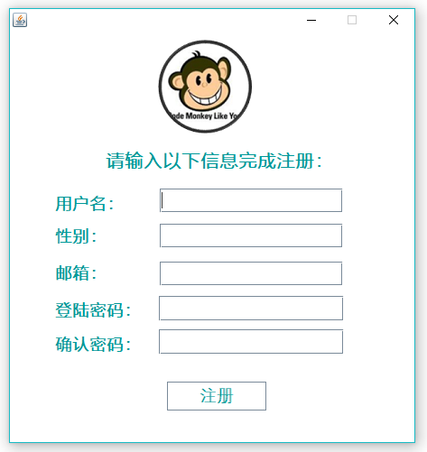

# WeChat
---
                                        
---                          
这是一个网络通信的聊天工具，支持局域网中免流量聊天，发文件，通信内容均采用TSL加密通信，放消息窃听，同时支持私聊和群聊，离线消息发送，
以及群发文件，这是最初始的版本，版本还在更新中

---

### 开启服务器消息转发，记录功能

### 账号注册

### 登陆

### 在线用户列表

### 私聊

### 建群添加群成员

### 群聊

### 文件发送

同时支持私聊端对端的文件发送和群聊基于非阻塞通信技术的群文件发送

### 离线消息发送

### 消息记录

***

*联系方式：*    

*博客：[X-Mallory.github.io](https://x-mallory.github.io/)*    

*邮箱：Guoyusu@outlook.com*

